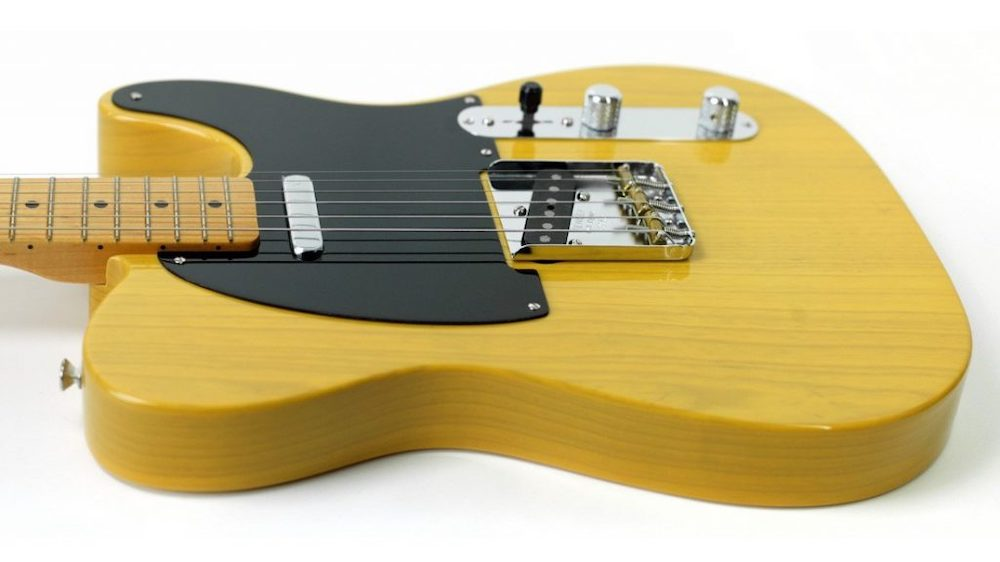
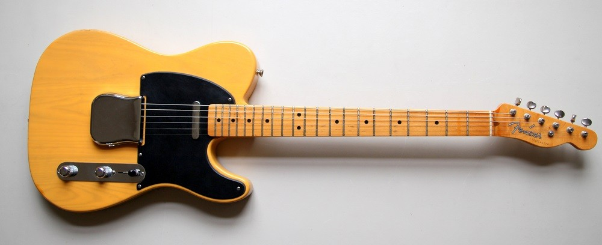
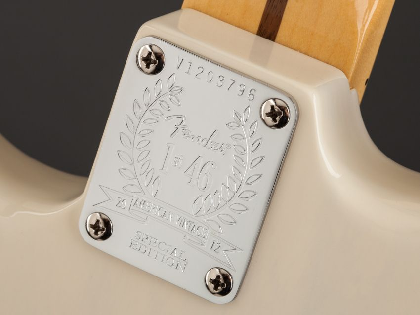
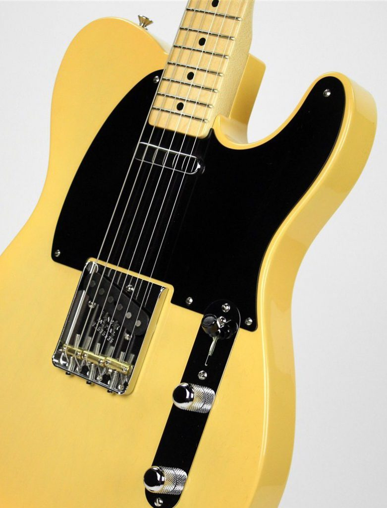

## The Telecaster Story

Long before the Fender 52 Telecaster Reissues, the Telecaster was developed by Leo Fender in Fullerton, California, and introduced in 1950 as Broadcaster. It is the world's first solid-body electric guitar that was commercially successful and has been in production ever since. Because of the black pickguard, the early Telecaster is sometimes called 'Black-guard' Telecaster.

Leo carried over features from the Hawaiian steel guitars Fender had already been making since 1945, such as the ashtray bridge cover and Kluson tuners. Its simple yet effective design with two pickups and a 3-way switch and revolutionary sound broke ground. Even today, with all of the technological advancements, this design satisfies the demanding needs of many guitarists.

## The 1952 Telecaster Reissue

In 1965 Leo Fender sold his company to the Columbia Broadcasting System (CBS), an American commercial broadcast television network. Under its new ownership, Fender produced numerous Telecaster spin-off models throughout the 70s. But most musicians played guitars from the 50s and 60s, then the new designs. Therefore Bill Schultz and Roger Balmer (CEO and VP) decided in 1981 to bring back the glory days of the pre-CBS era and the vintage reissue series was born. In March 1984, an investment group led by William (Bill) Schultz (Fender Musical Instruments Corporation or FMIC) bought Fender from CBS for twelve and a half million dollars. Because the deal did not include production facilities in Fullerton, California, the USA guitar production ceased in late 1984. In October 1985, production started in the new factory in Corona, California, where only the Vintage Reissue Stratocaster models were produced until 1986.

### The Specs of a 52 Telecaster

Main ingredients of a 1952 Telecaster:

* Body: Ash Neck: One-Piece Bolt-On Maple
* Fingerboard: Maple, 7.25 Radius
* Number of Frets: 21 Vintage Style Frets
* Position Inlays: Black Dot
* Pickups: Two Single-Coil Pickups with Volume and Tone Controls
* Switching: 3-Position Switch
* Bridge: 3-Saddle Strings-Through-Body Bridge with Brass Saddles
* Pickguard: 1-Ply Black

### Butterscotch Blonde

The original finish on a 1952 Telecaster was blonde. Since it had no UV inhibitors, the vintage blonde color turned into a faint yellow color over the years. Butterscotch Blonde (BSB) is supposed to simulate that color.

### Different Versions

Since 1982 there have been three different versions of the 52 Reissue made in the US.  
The following overview should give an idea of the differences and improvements that have been made over the years. It also should help to identify the different versions at a glance.

## U.S. Vintage Series 52 Telecaster

**1982 - 1997**
- Model no. 010-1303-850
- 4 digits stamped on the bridge plate (1982 until early 1988)
- 5 digits stamped on the bridge plate (from late 1988 to 2012)

Fender started making the first 52 reissues in 1982 in the Fullerton plant, but the first ones were allegedly assembled in Japan. The Southern California guitarist Ted Greene helped Fender with the design by referencing his extensive collection of old Telecasters. They were Fender's first try at recreating a 1952 Telecaster and had some historical inaccuracies:

- No 100% nitrocellulose finish
- A different headstock shape
- Wider 12th fret dot spacing
- Not 100% accurate body shape and radius
- Alnico 5 magnets pickups with plastic insulation wire
- A Top Hat switch tip (probably only on the first versions)

This version has a slim neck with a C profile and a 4 digits serial number stamped on the bridge plate.

## American Vintage Reissue 52 Telecaster

**July 1998 - August 2012**
- Model no. 010-0202-850  
- 5 digits stamped on the bridge plate

In 1998 Fender changed from the 1303 to the 0202 model. Because of the new name American Vintage Reissue, they often are referred to as AVRI. These guitars have a thicker neck than the previous ones, with a modest U profile and more accurate 12th fret markers. They also have a different color, and Fender changed to more vintage accurate Alnico 3 magnets pickups and a Barrel switch tip.

Until mid-2005, the guitars came with a Certificate Of Authenticity (COA) with the production date. After Bill Schultz aka “the man who saved Fender” died in 2006, the COA was discontinued.

    
")

## American Vintage 52 Telecaster

**August 2012 - 2017**
- Model no. 011-0202-850  
- V + 7 digits stamped on the bridge plate

The American Vintage 52 Telecaster (AV) was advertised as 'Pure Vintage' at first (e.g., see the last page of the [Fender American Vintage Brochure from 2012](https://paulreno.de/wp-content/uploads/2020/02/Fender-American-Vintage-Brochure-2012.pdf)). For this reissue, Fender did a complete redesign. To get the guitar as accurate as possible, the body dimensions and necks of several vintage guitars were remeasured.

### 1st of 46 Neck Plates

The first 46 instruments produced of each AV model featured a “1st 46” neck plate. Fenders 2012 Press Release:

_Fender is proud to announce the release of a limited number of the popular American Vintage Series instruments featuring 1st 46 neck plates, a designation given to the first 46 instruments of each model year. These neck plates commemorate the fact that Fender was founded in 1946, as well as the fact that Fender is releasing the most accurate and beautiful Fender reissue instruments ever from key historical years. The neck plate will serve as an indicator that these "1st 46" models were the first of their kind to be built, as well as add an element of collectability to these first run instruments. These units will be randomly distributed around the globe for Fender fans everywhere to have a chance to find one in their local stores._

_The American Vintage Series has long presented some of Fender's best-selling guitars (their early-80s introduction, in fact, was one of the first signs that Fender was "back" as the CBS era ended). Today, Fender has boldly cleared the slate to make way for a fresh American Vintage series with new features, new specs and the most meticulous level of vintage accuracy yet. Rather than just replacing the previous models with different ones, the entire vintage-reissue concept has been completely and comprehensively re-imagined—restoring original tooling dies, voicing new pickups, reformulating vintage colors and more—based on actual vintage guitars designers tracked down to ensure even greater accuracy._

_All the new American Vintage Series guitars feature thick and slim necks with profiles and edges carefully re-sculpted to reflect even greater period-correct authenticity, with both maple and rosewood fingerboards, vintage-style frets and bone nuts; all-new vintage-style pickups wound to period-correct specs and sound to accurately reflect specific model years, and even specific periods within specific model years; retooled pickguards, parts, and hardware designed to accurately reflect specific model years (and again, even specific periods within specific model years), and standard and custom-color finishes re-formulated for even greater period-correct authenticity._

_The new guitars are the American Vintage 56, 59 and 65 Stratocaster models (56 model also in left-handed version), American Vintage 58 and 64 Telecaster models (64 model also in left-handed version), American Vintage 65 Jazzmaster and American Vintage 65 Jaguar. Also, the American Vintage 52 Telecaster returns to the fold (in right- and left-handed versions) with body, neck, and pickups refined with the best features—tones, curves, perimeters, radii and more—from a handful of extraordinary 52 Telecaster specimens examined by Fender craftsmen._ - Fender

The Pickups are more vintage-accurate sounding and still have Alnico 3 magnets. The Barrel switch tip has a recessed top which is also more accurate. On some of the previous models, one could see the pickup cavity under the bridge. Not so with the new models.

The neck lacquer on the AV 52 Telecasters is virtually untinted. In comparison, previous models have had an orangeish heavily tinted neck. The new ones look much lighter. The neck has rolled edges that give it a broken-in feel. The frets are more rounded on the top, giving them a feeling of being taller without actually being it. Some people expressed concern that the rolled edges could make refretting harder, if necessary. But I have not yet heard of anybody actually refretting one.
The color of the BSB is also lighter and less orangeish. Previous models were sometimes called “Pumpkincaster”. While you could see through the previous finish, the new one has a tint so you can see less of the grain.

The AV 52 Tele was the first of the 52 reissues to have a Flash Coat Lacquer (supposedly the same lacquer as Fenders Thin Skin models) that was all Nitro with a Nitro Sanding sealer, Nitro color, and Nitro topcoat (according to Rob Schwarz, Fender). The [Vintage Lacquer Information Sheet](https://paulreno.de/wp-content/uploads/2020/02/Fender-American-Vintage-Lacquer-Information-2012.pdf) was part of the case candy and warned customers about possible “checking” or cracking of the wood. When Fender replaced the AV series with the American Original (AO) they started using the same body finishes as the AVRI (urethane base coat under lacquers) again.

This is the first 52 Tele Reissue that comes with a thinner case and the modern wiring of bridge/both/neck standard and a kit to convert it to the vintage wiring (bridge/neck/neck with the tone capacitor) (see [AV 52 Telecaster Service Diagram](https://paulreno.de/wp-content/uploads/2020/02/Fender-American-Vintage-52-Telecaster-Service-Manual-2012.pdf)). All prior versions came from the factory with the vintage wiring and the kit to convert it to modern wiring (e.g. see [AVRI 52 Telecaster Service Diagram](https://paulreno.de/wp-content/uploads/2020/02/Fender-American-Vintage-Reissue-52-Telecaster-Service-Manual-1998.pdf)).  
It is also the first one where the serial number reveals the year of production. If it says V**12** + 5 digits stamped on the bridge plate, the guitar was made in 20**12**.

### AV 52 Telecaster Specs

- Body: Premium Ash Body
- Neck: 1-Piece Maple, U-Shape, (Nitrocellulose Lacquer Finish)
- Fingerboard: Maple, 7.25" Radius (184 mm)
- No. of Frets: 21 Vintage Style Frets
- Pickups: 2 American Vintage Tele® Single-Coil Pickups
- Controls: Master Volume, Master Tone
- Pickup Switching: 3-Position Blade-
- \-Position 1. Bridge Pickup
- \-Position 2. Neck Pickup with Tone Control (Bright Vintage Circuit)
- \-Position 3. Neck Pickup with No Tone Control (Dark Vintage Circuit)
- Bridge: Original Vintage Tele Bridge with 3 Brass Saddles
- Machine Heads: Fender®/Gotoh® Vintage Style Tuning Machines
- Hardware: Nickel/Chrome
- Pickguard: 1-Ply Black, (5-Hole)
- Scale Length: 25.5" (648 mm)
- Width at Nut: 1.650" (42 mm)
- Unique Features: U Shape Maple Neck, Black Dot Position Inlays, Vintage styling, Synthetic Bone Nut
- Strings: Fender Super 250R, Nickel Plated Steel,
- Gauges: (.010, .013, .017, .026, .036, .046),

## Other Versions

There has been a Factory Special Run (FSR) Limited Edition American Vintage 52 Telecaster Korina which had a Korina body and was part of the 10 for 15 Limited Collection in 2015. There also were some Hot Rod 52 Telecaster Reissues with a Neck Humbucker. Then there are the Fender Custom Shop (CS), Made in Japan (MIJ), Crafted in Japan (CIJ), Made in Mexico (MIM), and Squire 52 Telecaster models.

## Famous Players

- Bruce Springsteen
- David Gilmour (Pink Floyd)
- Graham Coxon (Blur)
- Ian D'Sa (Billy Talent)
- James Hetfield (Metallica)
- Jimmy Page (Led Zeppelin)
- Keith Murray (We Are Scientists)
- Mick Jagger (Rolling Stones)
- Robert Quine (Richard Hell & The Voidoids)
- And many more...

## Downloads

- [Fender U.S. Vintage 52 Telecaster Manual 1981](https://paulreno.de/wp-content/uploads/2020/02/Fender-US-Vintage-52-Telecaster-Manual-1981.pdf)
- [Fender U.S. Vintage 52 Telecaster Manual 1986](https://paulreno.de/wp-content/uploads/2020/02/Fender-US-Vintage-52-Telecaster-Manual-1986.pdf)
- [Fender American Vintage Reissue 52 Telecaster Service Diagram 1998](https://paulreno.de/wp-content/uploads/2020/02/Fender-American-Vintage-Reissue-52-Telecaster-Service-Manual-1998.pdf)
- [Fender American Vintage 52 Telecaster Service Diagram 2012](https://paulreno.de/wp-content/uploads/2020/02/Fender-American-Vintage-52-Telecaster-Service-Manual-2012.pdf)
- [Fender American Vintage Lacquer Information Sheet (2012)](https://paulreno.de/wp-content/uploads/2020/02/Fender-American-Vintage-Lacquer-Information-2012.pdf)
- [Fender American Vintage Brochure 2012](https://paulreno.de/wp-content/uploads/2020/02/Fender-American-Vintage-Brochure-2012.pdf)

