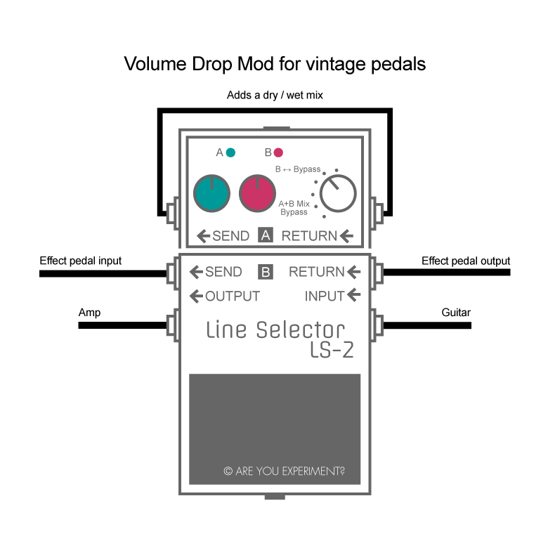

## Simple mod for vintage pedals
Some disadvantages come with vintage pedals (like the MXR Phase 90 or the Electro Harmonix Electric Mistress):

1. Some of them have a lower output volume or a bad buffer
2. Most vintage pedals have no dry/wet mix
3. Almost all of them have no status LED

But there is help: the Boss LS-2!

If you want to compensate for a volume drop, set the LS-2 to 'B BYPASS' and turn the red knob clockwise to get more volume.

To add a dry/wet mix, set the LS-2 to 'A+B MIX BYPASS' and add a patch cable from Send A to Return A (see picture above). Use the green knob to set the amount of the dry signal and adjust the volume with the red knob.

This way, you can easily add a dry/wet mix to any vintage pedal and compensate for a volume drop. The LS-2's LED shows whether the effect is engaged or not.